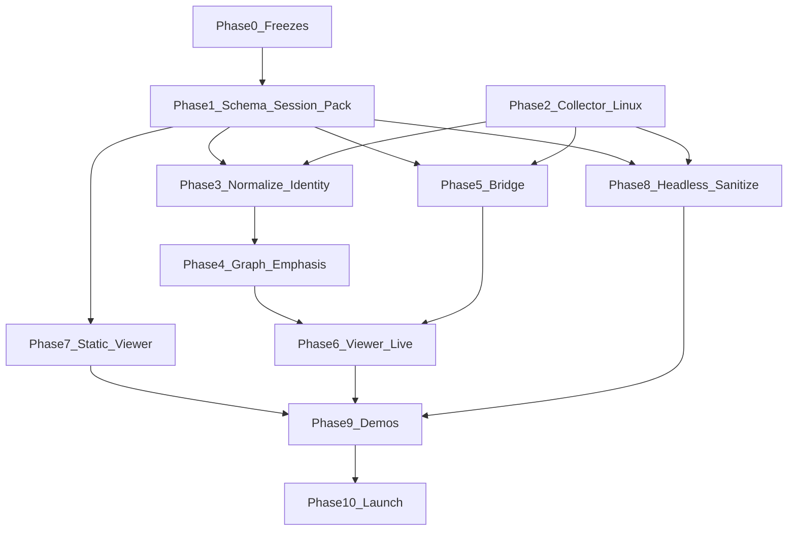

# Glass v0 — implementation build plan

**Authority (locked product spec):** `GLASS_FULL_ENGINEERING_SPEC_v10.md` in this directory. This file is **implementation and program control only**. It does not modify, restate, or relax the spec.

**Scope:** Glass v0 breakout only. No new product surface beyond what v10 already implies. Do not grow Glass into a generic observability, SIEM, fleet, or “secret scanning” platform.

---

## What changed in this revision

1. **Sanitization** — Phase 1 and Phase 8 treat share-safe export as **trust-critical**: fixture matrix, leak checks, causality-preserving round-trip, **human-readable redaction summary** aligned with §28.4 / §30.2. Merge/release gates fire when schema, pack format, or event attributes touch sensitive fields. **If operators do not trust the redaction summary, they will not share replay packs**—plan treats that as a launch blocker, not a nice-to-have.

2. **Golden-scene regression** — Starts in **Phase 6** as soon as frames are deterministic enough to capture. **Visual regressions are product regressions.** CI, baseline policy, and merge gates are specified; Phase 10 does not “introduce” golden tests from scratch.

3. **Stale-state resync** — Phase 5 and Phase 6 require **aggressive** tests: tab throttling, **dropped** frames/messages, **duplicate and out-of-order** delivery, backlog floods, main-thread / event-loop stalls. Recovery must use **bounded fresh snapshot + new stream cursor** only; **full session restart is not an acceptable recovery strategy** for viewer staleness (§18A.3).

4. **HVT** — Single versioned rules file, **≤ ~20 explicit patterns** (§16.2A), **mechanical count check in CI**, contribution rule, release verification. **Not** a generic secret scanner: no ML, entropy detectors, or unbounded keyword lists.

5. **Sequencing** — **No phase reorder.** Replay/static Tier B value stays early; Linux collector remains parallelizable after P1 spine. The priorities above add **work inside** existing phases, not a new waterfall gate before demos.

---

## Where execution priorities apply

| Priority | Phases | Tests | Merge gate (§32.1 + program) | Release gate (§32.2 + program) | Notes |
|----------|--------|-------|------------------------------|--------------------------------|-------|
| **1 Sanitization / trust** | P0 policy; **P1** pack fields + redactor + fixtures; **P7** static load; **P8** E2E | Round-trip; leak scans on serialized pack; causality invariants; summary matches applied rules | Changes to schema, `.glass_pack`, or attrs for paths, argv, network, IPC, hostnames, sockets → update fixtures + green sanitization CI | Realistic shareable pack verified; matrix exercised (CI or signed manual run); summary trusted for public post | Summary must be **human-readable** per spec intent; machine-readable companion optional but not sufficient alone for trust |
| **2 Golden-scene** | **P6** tooling + baselines; **P9** per primary demo; **P10** widen coverage only | CI job on protected paths; fail on unintended diff | PRs touching shaders, LOD, bundling, frosted zones, emphasis halos, layout affecting demos → golden impact resolved (update baselines with review, or fix bug) | Primary demo golden scenes green; policy doc exists | Baseline updates are **reviewed intentional changes**, not silent commits |
| **3 Resync** | **P5** bridge behavior + fault injection; **P6** viewer state machine | Drops, dupes, reorder, flood, slow consumer, tab hidden, long-task stall | Stream protocol, snapshot, cursor, or viewer live merge → resync tests updated | Release checklist runs full resync playbook; no session restart for recovery | Bridge must not require new `sessions/start` for viewer catch-up |
| **4 HVT cap** | P0 freeze; **P4** ship rules file | Count ≤ cap; opt-out/explain per spec | Any edit to HVT file → count CI green + maintainer review + no catch-all buckets | Release script/test proves count and file location | v0 program: **freeze count**; expand only after spec change, out of this plan’s scope |
| **5 Sequencing** | DAG unchanged (see below) | — | — | — | Breakout-first preserved |

---

## Program gates — at a glance

**Merge (every PR that touches listed surfaces):**

- **Sanitization:** sensitive-field paths → fixtures + sanitization tests green.
- **HVT:** rules file → `count <= 20` (or frozen integer from Phase 0) + narrow diff.
- **Live streaming:** bridge or viewer live path → resync tests green.
- **Rendering:** `wgsl/`, render graph, LOD, bundling, emphasis presentation, zone glass materials, demo-critical layout → golden-scene impact closed.

**Release (additive to §32.2):**

- Sanitization trust: realistic pack + matrix coverage + no leak regressions; operators can rely on **human-readable** summary next to a public link.
- Golden: named scenes for primary demos pass CI; tolerance and capture environment documented.
- Resync: throttled tab, backlog, WS disruption (including dup/reorder), event-loop stall — all recover via snapshot + cursor; session continues.
- HVT: mechanical count + “not a scanner” posture unchanged.

---

## Repository bootstrap

Per spec §8 / §8A: `collector/`, `schema/`, `session_engine/`, `graph_engine/`, `viewer/`, `bridge/`, `demos/`, `docs/`, `scripts/`, `tests/`, `assets/`, `tools/`.

**Plan-specific paths:**

- `tools/golden_scenes/` — capture, baselines, CI driver.
- `tests/fixtures/sanitization/` — messy path/network/argv/hostname/socket cases with expected post-sanitize bytes and causality checks.
- Sanitization implementation: `session_engine/` and/or `collector/` per crate split — **pure** transform + summary emission for testability in P1.

**CI (minimum):**

- **Sanitization job:** required after P1 merges; runs on every change to schema, pack I/O, sanitization module, or normalization of path/network/argv.
- **Golden-scene job:** required once P6 produces stable capture; runs on PRs touching protected viewer/render paths (listed in Phase 6).
- **HVT count job:** runs on every PR touching the rules file.

**Repository law (§8A.1):** unchanged.

---

## Phase 0 — Design freezes (§30A)

Close all §30A items. **These blocks are tightened for executability:**

| Freeze | Outcome |
|--------|---------|
| §30A.6 Visual regression | Pick **one** comparison method (pixel diff + tolerance vs hash-based); pin **CI OS/GPU/browser** or document allowed variance; define **baseline update** = reviewed PR with before/after artifacts; **forbidden:** silent baseline drift. |
| §30A.10 Sanitization | Freeze **human-readable summary** field set (what was redacted, rule id), default share-safe rules, and **causality preservation** definition for round-trip tests. |
| §30A.12 HVT | Freeze **integer cap** (default **20**, consistent with §16.2A “on the order of twenty”); freeze file path; CI reads same cap from single config. |
| §30A.5 / §18A.3 | Freeze **backlog threshold** (events and/or bytes) and **`resync_hint`** semantics for tests. |

**Deliverable:** Short internal doc **Sanitization trust criteria** (maintainers only): share-candidate pack conditions + who signs off for release.

---

## Phase 1 — Schema and session spine (§36A.1, §12–§14)

**Core:** Schema, bindings, append-only session, `.glass_pack`, replay load path, validators.

**Sanitization (P1 — required):**

- Manifest/pack: `sanitized`, **human-readable redaction summary** (and optional structured detail), sanitization **profile version**.
- Implement redaction as **pure function** over normalized events for unit tests without collector.
- **Fixture matrix (minimum):** private/internal IP literals, **user home** and `~/` forms, **argv** secrets-shaped tokens, **internal hostnames**, **sensitive socket paths/names** — plus negative cases where redaction must **not** destroy causal edges between non-secret entities.
- **Tests:** byte/string leak grep on output artifact; graph or event-sequence **causality** invariants vs pre-redaction goldens (method frozen in P0).
- **Rule:** without trusted summary + passing matrix, **do not** ship public replay packs.

**Merge gate:** schema/pack/event attrs touching sensitive fields → fixtures + sanitization CI green.

---

## Phase 2 — Collector — Linux (§10)

Scope unchanged. Sanitization **not** applied on every raw event — only on export/pack path (P1 module, P8 CLI).

**Merge gate:** new raw fields that may carry PII/secrets → extend sanitization fixtures before release.

---

## Phase 3 — Normalization and identity (§11, §13)

Scope unchanged.

**Merge gate:** path/network/argv normalization changes → sanitization matrix + CI.

---

## Phase 4 — Graph engine and emphasis (§15–§16)

Graph unchanged.

**HVT (§16.2A):**

- One file, e.g. `collector/config/hvt_rules.toml`; **≤ 20 patterns** (or P0-frozen integer).
- **CI:** fail if count > cap.
- **Contributing.md (or PR template):** HVT edits require (1) count check, (2) maintainer review, (3) one-line justification per pattern, (4) **no** generic “secret” regex blobs.

**Merge gate:** HVT file diff → above satisfied; inspector copy updated if behavior changes.

---

## Phase 5 — Bridge and local API (§18, §18A)

**Resync (required):**

- Implement §18A.3: viewer may drop backlog, show stale state, **GET bounded snapshot**, **new cursor**, continue — **session does not restart**.
- **Harness tests:** WebSocket **message loss**, **duplicates**, **out-of-order** batches, **burst backlog**, **slow client**; assert server emits consistent snapshot/cursor contract and does not force `sessions/start` for catch-up.
- Document server-side max queued delta before hint/pushback.

**Merge gate:** protocol/snapshot/cursor changes → harness + (when P6 exists) viewer integration test updated.

---

## Phase 6 — WebGPU viewer (§19–§20, §22–§24)

**Golden-scene (early):**

- First milestone with stable resolution + camera + fixture pack: add capture script and **baseline artifacts**.
- **CI:** fail on unexpected diff; path filters include `viewer/**/wgsl/**`, render pipeline, LOD, edge bundling, emphasis halos, frosted-glass zone passes, layout code marked demo-critical.
- **Baseline update policy:** (1) open PR titled or labeled as baseline update; (2) attach visual before/after or diff; (3) **two-person rule** optional but recommended for launch branch; (4) never commit baselines to “fix CI” without review.

**Resync (viewer-side):**

- Tests/playbook: **background tab** / visibility hidden, **WS reconnect** after drops, **dup/reorder** handling, **injected backlog** beyond client buffer, **`requestAnimationFrame` / long-task** stall then recovery.
- **Pass:** visible resync state, snapshot fetch, new cursor, valid session id, inspector coherence; **fail:** requiring operator to stop and start capture to fix viewer lag.

**Merge gate:** golden + resync impact addressed for protected edits.

---

## Phase 7 — Static replay viewer (§28.3)

Load sanitized packs from fixtures; no network; DOM/text leak assertions for fixture subset.

**Tests:** sanitized `.glass_pack` open path; memory smoke.

---

## Phase 8 — Headless capture and CLI (§28.4)

**E2E sanitization:**

- `glass capture --headless … --out …` and `--sanitize` / `--redact` per spec.
- Run **full** pipeline against P1 fixtures **plus** CI-generated “dirty” scenarios (argv, resolver names) where feasible.
- **Human-readable summary** in pack must **match** applied transforms.
- Exit code passthrough unchanged when sanitize on.

**Merge gate:** CLI/export changes → E2E sanitization green.

---

## Phase 9 — Demos (§25, §31A)

Each **primary** demo (§25.2): at least one **golden scene**; §31A checklist includes golden pass.

Public-facing packs: share-safe lane per spec; verified with same methodology as P1/P8.

---

## Phase 10 — Launch hardening (§36A.6, §26, §29, §32–§33)

Performance, docs, README per spec. **Do not** defer golden-scene bootstrap here—only add hardware variants or missing demo baselines.

**Release verification:** full **Program gates — at a glance** release bullet list + §32.2 spec checklist.

---

## Dependency graph (unchanged — priority 5)

**Sequencing note:** P1+P7 can proceed before P2 is complete; P6 live mode needs P5+P4; P8 needs writable session path from P1/P2.

---

## Non-goals

Per spec §3.3, §10.4: no SIEM replacement, no fleet mesh, no universal profiling, no v0 Windows/macOS **full** collectors, no HVT as generic secret scanner.

---

## Open freeze decisions (human)

These require an explicit owner decision in Phase 0; the plan does not guess the spec:

- **Golden-scene comparison:** pixel-diff tolerance values vs perceptual hash; how much GPU/driver variance is acceptable in CI.
- **Resync backlog threshold:** exact event count and/or byte ceiling for `resync_hint` emission.
- **HVT integer:** confirm **20** vs another integer still consistent with §16.2A “on the order of twenty” for the frozen v0 file.
- **Sanitization:** final canonical list of “sensitive socket name” patterns for default profile (within §30.2 honesty—must not claim coverage Glass does not have).

---

## Document history

- **Current:** Execution guidance revision — sanitization trust, early golden CI, resync hardening, HVT mechanics, sequencing preserved (see “What changed”).
