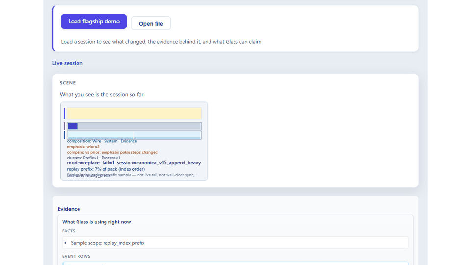
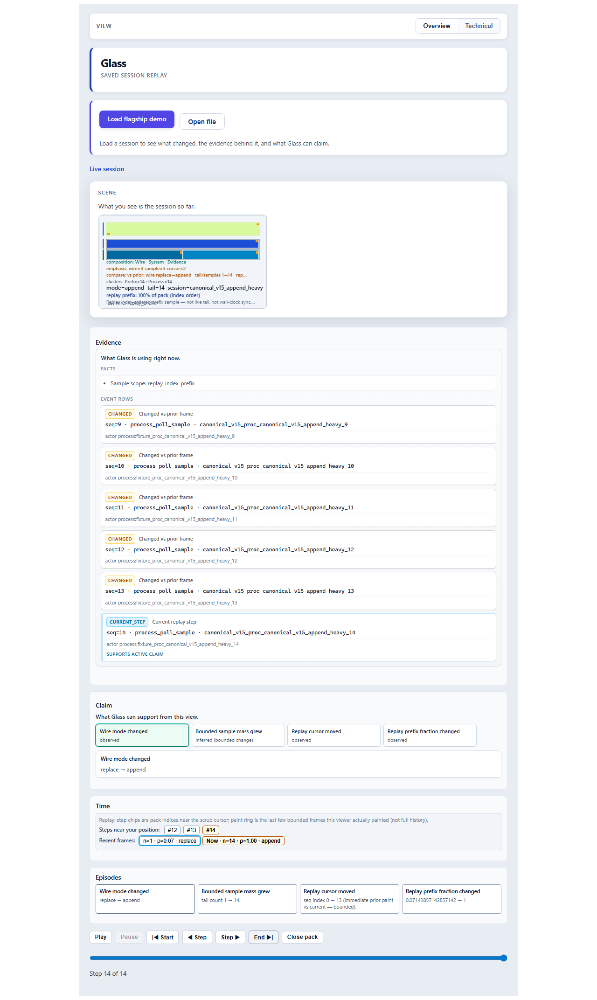
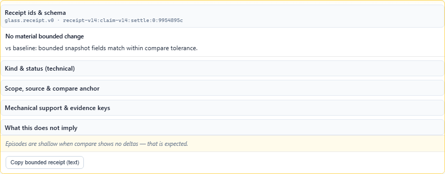
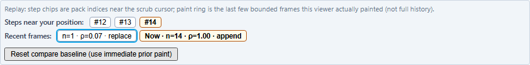
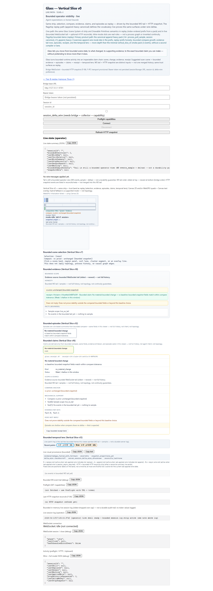

# Glass

**See what your code or agent actually did.**

Glass is a **replay-first bounded investigation surface**: open one saved session, move from **scene** to **change** to **evidence** to **receipt**, and stop at what the bounded window can honestly support.

**Start with the flagship replay path:** open `tests/fixtures/canonical_scenarios_v15/canonical_v15_append_heavy.glass_pack` and stay on **Overview** first.



**Bounded showcase only:** not cloud-hosted Glass, not full topology runtime, not final **F-IPC** transport. The optional local **`?live=1`** shell is secondary.

## Proof

- **Fixtures:** committed flagship, smoke, and canonical scenario packs under `tests/fixtures/`
- **CI + bootstrap:** replay, lint, tests, and fixture validation stay green
- **Validator:** `glass-pack` checks the shipped `.glass_pack` artifacts directly
- **Current truth:** `VISION.md`, `docs/IMPLEMENTATION_STATUS.md`, `docs/TEST_STRATEGY.md`, `docs/REPO_BOUNDARIES.md`

## What Glass Lets You See

| | |
|--|--|
| **scene** | Current bounded **Glass Scene v0** — honest prefix/tail view, not full history. |
| **change** | **Compare** against a declared baseline — not causal inference. |
| **evidence** | Drilldown **rows/facts** from the bounded window — not a complete trace. |
| **receipt** | **Viewer-derived** claim text; **weak** / **unavailable** when support is thin — not a collector certificate. |

Replay uses an index-ordered pack prefix. Live keeps WS tail and HTTP snapshot **separate**.

## Start Here

1. Run the viewer locally: `cd viewer && npm ci && npm run dev`
2. On replay, use **Load flagship demo** (dev only) or **Open file** and pick `tests/fixtures/canonical_scenarios_v15/canonical_v15_append_heavy.glass_pack`
3. Stay on **Overview** first. Use **Technical** only when you want exact scan order, ids, manifests, receipt refs, and transport detail.
4. Static `dist/` does not auto-load fixtures. Optional **`?live=1`** is local-only and not the front door.

## Screenshots

**How these were taken:** The flagship motion asset above and the stills below come from the real viewer surface. Replay frames use **`?fixture=flagship`** with the committed flagship pack; live uses **`?live=1`** in honest local setup mode. Regenerate with **`npm run capture:showcase-media -- http://127.0.0.1:5173`** after `npx playwright install chromium` once (replace `5173` if Vite chooses another port). Synthetic committed fixtures only — not production telemetry.

| | |
|:--|:--|
|  | **01 — Replay overview.** Flagship replay at the strong end of the pack: scene first, then evidence, claims, time context, and episodes. |
|  | **02 — Claim chain.** Selected claim plus **`glass.receipt.v0`** receipt detail. |
|  | **03 — Temporal lens.** Bounded compare baseline selection — not a full history timeline. |
|  | **04 — Live shell.** Local-only setup-first shell; evidence, episodes, claims, and receipt wait for real live data. |

Capture notes and file order: **[docs/media/README.md](docs/media/README.md)**.

## What This Repo Actually Ships

| In scope (current public surface) | Out of scope (honest) |
|-----------------------------------|------------------------|
| Replay-first bounded showcase path | Production collector/bridge operations at scale |
| Scene System v0 + bounded claims / receipts | Final **F-IPC** transport |
| Canonical suite + green CI + fixture validation | Phase-6 **full topology runtime** |
| Optional local **`?live=1`** shell | Cloud-hosted Glass |

## Current Truth vs Long Horizon

**Current shipped bounded showcase truth:**

| Doc | Use |
|-----|-----|
| **[docs/README.md](docs/README.md)** | Docs index: current truth vs proof vs history |
| **[VISION.md](VISION.md)** | Product scope, strategy, honest boundary |
| **[docs/IMPLEMENTATION_STATUS.md](docs/IMPLEMENTATION_STATUS.md)** | What is implemented now |
| **[docs/TEST_STRATEGY.md](docs/TEST_STRATEGY.md)** | Verification map and CI coverage |
| **[docs/REPO_BOUNDARIES.md](docs/REPO_BOUNDARIES.md)** | Ownership and layering |
| **[docs/VERTICAL_SLICE_V0.md](docs/VERTICAL_SLICE_V0.md)** | Milestone history behind the current surface |

**Long-horizon references (not the current launch contract):** `docs/long-horizon/GLASS_FULL_ENGINEERING_SPEC_v10.md` · `docs/long-horizon/GLASS_V0_BUILD_PLAN.md`

## Flagship Depth vs Breadth

| | Pack / role |
|--|-------------|
| **Flagship (depth)** | `canonical_v15_append_heavy.glass_pack` — session `canonical_v15_append_heavy`, append-heavy Tier B: compare, evidence, episodes, claims, receipts, temporal lens. **Primary** demo. |
| **Smoke (CI)** | `tests/fixtures/vertical_slice_v0/glass_vertical_slice_v0_tier_b.glass_pack` — 3 events, fast checks. |
| **Breadth (suite)** | Four packs under `tests/fixtures/canonical_scenarios_v15/` — replace, append, calm/steady, file-heavy ([folder README](tests/fixtures/canonical_scenarios_v15/README.md)). **Supporting** proof, not a second product. |

## Layout

| Path | Role |
|------|------|
| `schema/` | Canonical JSON Schema + bindings/migrations placeholders |
| `session_engine/` | Events, session append model, `.glass_pack` I/O, **pure** sanitization |
| `graph_engine/` | Derived graph helper (minimal; no presentation) |
| `collector/` | Linux collector + adapters / retained loops / F-IPC inputs |
| `bridge/` | Local loopback bridge (`glass_bridge`) — HTTP/WS per docs |
| `viewer/` | Replay-first bounded showcase + optional local **`?live=1`** shell |
| `tools/glass-pack` | CLI: validate / inspect packs; strict kinds + share-safe vs raw-dev |
| `tools/golden_scenes/` | Golden-scene harness scaffold |
| `docs/` | Status, boundaries, tests, contracts, media guidance |
| `scripts/retained_snapshot_demo/` | Retained collector ↔ bridge snapshot demo |
| `tests/fixtures/` | `vertical_slice_v0/`, `canonical_scenarios_v15/` |

## Verify Bootstrap

```bash
# Unix
./scripts/bootstrap_check.sh

# Windows
powershell -ExecutionPolicy Bypass -File scripts/bootstrap_check.ps1
```

Those bootstrap scripts run the same bounded-showcase viewer gates as CI: `build`, `test`, `lint`, `verify:vertical-slice-fixture`, and `verify:canonical-scenarios-v15`. They prefer `npm ci` and fall back to `npm install` if a local file lock blocks a clean reinstall.

Or manually:

```bash
cargo fmt --all -- --check
cargo clippy --workspace --all-targets -- -D warnings
cargo test --workspace
cd viewer
npm ci
npm run build
npm test
npm run lint
npm run verify:vertical-slice-fixture
npm run verify:canonical-scenarios-v15
```

## `glass-pack` CLI

```bash
cargo run -p glass-pack -- validate path/to/file.glass_pack
cargo run -p glass-pack -- validate path/to/share.glass_pack --strict-kinds --expect-share-safe
cargo run -p glass-pack -- validate path/to/dev.glass_pack --expect-raw-dev
cargo run -p glass-pack -- info path/to/file.glass_pack
cargo run -p glass-pack -- info path/to/file.glass_pack --json
```

Procfs dev → share flow: `glass-collector normalize-procfs` (raw pack) → `glass-collector export-procfs-pack` (sanitized) → `glass-pack validate … --expect-share-safe`. Details: `tools/glass-pack/README.md`.

## Local Live Shell (Optional)

HTTP bearer token (for `Authorization: Bearer …` and optional WS `?access_token=` on loopback) is **separate** from the provisional **F-IPC** shared secret:

```bash
cargo run -p glass_bridge -- --help
cargo run -p glass_bridge -- --token dev-http-bearer
```

Optional bounded snapshot via provisional TCP to `glass-collector ipc-serve` (loopback only):

```bash
cargo run -p glass-collector -- ipc-serve --shared-secret fipc-dev --listen 127.0.0.1:9876
cargo run -p glass_bridge -- --token dev-http-bearer --collector-ipc-endpoint 127.0.0.1:9876 --collector-ipc-secret fipc-dev
```

Default bridge listen: `127.0.0.1:9781`. **`?live=1`** is a local shell for bridge setup, bounded visual inspection, and transport honesty — not hosted Glass and not the repo front door.

Retained snapshot demo: [`docs/DEMO_RETAINED_SNAPSHOT.md`](docs/DEMO_RETAINED_SNAPSHOT.md) and `scripts/retained_snapshot_demo/`. CI runs `cargo test -p integration_tests --test retained_snapshot_demo_smoke`.

## License

Dual-licensed under `MIT` or `Apache-2.0`, at your option. See `LICENSE-MIT` and `LICENSE-APACHE`.

Security reporting: see `SECURITY.md`.
